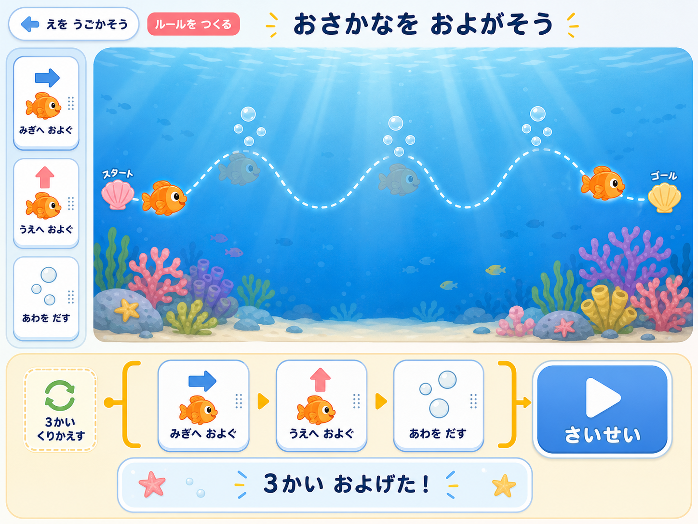

# Eash-Scratch

<p align="center">
  <a href="https://easy-scratch.web.app/?grade=lower&amp;page=program&amp;lesson=fish">
    
  </a>
</p>

Scratchの考え方を、より使いやすく、すぐ試せる形で体験するための初学者向けWeb教材です。

命令カードを並べてルールを作り、実行結果を見ながら何度も直せます。低学年向けにはタップ中心の操作、高学年向けには数値・座標・繰り返しを使う課題を用意しています。

> [!NOTE]
> 本教材はScratch公式の製品・プロジェクトではありません。Scratchに親しむ前段階として、プログラミングの基本的な考え方を簡単な操作で学ぶことを目指しています。

## 公開教材

- 教材TOP: https://easy-scratch.web.app/
- 講師向け案内: https://easy-scratch.web.app/teacher.html
- サイトマップ: https://easy-scratch.web.app/sitemap.xml

## Eash-Scratchの考え方

Eash-Scratchは、Scratchそのものを小さく再現する教材ではありません。Scratchで大切になる「命令を組み合わせる」「順番を考える」「繰り返す」「結果を見て直す」という考え方へ、迷わず入るための導入教材です。

初めての子どもが、操作方法を覚えることだけで時間を使わず、作ったルールと動いた結果の関係に集中できることを大切にしています。そのため、学年に合わせて選択肢を絞り、iPadで触りやすい大きなカードやボタンを使っています。

### 大切にしていること

- **自分でルールを作る**: 正解を選ぶだけではなく、命令の順番や数値を自分で決めます。
- **完成前でも動かせる**: 間違ったルールも実行でき、動きを見て何度でも直せます。
- **繰り返しを仕組みにする**: 同じ命令を並べ続けるのではなく、まとまりを何回使うか考えます。
- **結果を目で比べる**: 目標線と実際の線、計算結果や所要時間を見比べ、違いの理由を考えます。
- **次の学びへつなぐ**: Eash-Scratchで体験した順次処理、繰り返し、変数、座標の考え方を、Scratchのブロックプログラミングへつなげます。

Eash-Scratchは自由な作品制作やScratchプロジェクトとの互換性を目的としていません。短い授業時間でも「考える→作る→動かす→直す」を体験し、その後にScratchでより自由な表現へ進みやすくすることが目的です。

## 教材で学ぶこと

1. 計算や絵の動きを「ルール」にする
2. 作ったルールを繰り返し使う
3. ルールを組み合わせて、便利な仕組みにする
4. 実行結果を見て、試行錯誤しながら直す

## 主な教材

- 1〜3年生
  - 記号を組み合わせる計算マシン
  - ジャンプ、魚の動き、お絵かきカー、方眼紙の色ぬり
- 4〜6年生
  - 複数の演算を組み合わせる計算マシン
  - 座標レスキュー、ロボット・フリーキック、パターンアート、座標いろぬりラボ

授業案は[プログラミング講義カリキュラム](docs/programming-curriculum.md)を参照してください。

## 対応環境

- 教材利用: iPad Pro / Safari
- 開発・ローカル確認: macOS、Windows、Linux
- Node.js 20以上
- npm 10以上を推奨

アプリのインストール、アカウント作成、ログイン、個人情報入力は不要です。

## ローカルで起動する

### 1. リポジトリを取得する

```sh
git clone https://github.com/yutakikuchi/easy-scratch.git
cd easy-scratch
```

### 2. 必要な環境を確認する

```sh
node -v
npm -v
```

Node.jsがない場合は、[Node.js公式サイト](https://nodejs.org/)からLTS版をインストールしてください。

### 3. セットアップする

```sh
npm ci
```

現在は外部npmパッケージに依存していませんが、環境を揃えるために実行してください。

### 4. 開発サーバーを起動する

```sh
npm start
```

ブラウザで次のURLを開きます。

```text
http://127.0.0.1:43127/
```

このサーバーはブラウザキャッシュを無効化するため、CSSやJavaScriptの変更を確認しやすくなっています。終了するときは、起動したターミナルで `Ctrl + C` を押します。

### 別のポートで起動する

```sh
node scripts/serve-no-cache.mjs 49173
```

この場合のURLは `http://127.0.0.1:49173/` です。

## iPadでローカル環境を確認する

MacまたはPCとiPadを同じWi-Fiへ接続し、LAN向けサーバーを起動します。

```sh
npm run start:lan
```

MacまたはPCのローカルIPアドレスを確認し、iPadのSafariで次の形式のURLを開きます。

```text
http://192.168.x.x:43127/
```

注意点:

- `192.168.x.x` は開発PCの実際のIPアドレスへ置き換えてください。
- OSのファイアウォールが表示された場合は、ローカルネットワークからのNode.js接続を許可します。
- 学校や公共Wi-Fiでは端末間通信が禁止されていることがあります。その場合は公開URLを使用してください。
- LAN向けサーバーをインターネットへ直接公開しないでください。

## 画面を直接開くURL

```text
TOP:                     http://127.0.0.1:43127/
1〜3年生・計算:          http://127.0.0.1:43127/?grade=lower&page=calculation
1〜3年生・絵を動かす:   http://127.0.0.1:43127/?grade=lower&page=program
4〜6年生・計算:          http://127.0.0.1:43127/?grade=upper&page=calculation
4〜6年生・絵を動かす:   http://127.0.0.1:43127/?grade=upper&page=program
講師向け案内:            http://127.0.0.1:43127/teacher.html
```

## テストとビルド

```sh
npm test
npm run build
```

- `npm test`: 静的ファイル、計算ロジック、絵を動かす教材の検証
- `npm run build`: `public/` を配布用の `dist/` へコピー

生成された `dist/` はGit管理の対象外です。

## Firebase Hostingへ公開する

### 1. Firebase CLIを準備する

```sh
npm install -g firebase-tools
firebase login
```

### 2. Eash-Scratchプロジェクトを確認する

```sh
firebase use
```

このリポジトリは `.firebaserc` のデフォルトプロジェクトと、`firebase.json` のHostingサイトをどちらも `easy-scratch` に指定しています。別プロジェクトへ誤って公開しないよう、デプロイ前に表示を確認してください。

### 3. ビルドして公開する

```sh
npm run build
firebase deploy --only hosting --project easy-scratch
```

`npm run deploy:firebase` でも同じ手順をまとめて実行できます。`firebase.json` の `site` とコマンドの `--project` の両方で `easy-scratch` を指定しているため、Hostingの公開先が明確です。また、キャッシュを無効化しており、授業中に古いCSSやJavaScriptが残りにくい構成です。

## Firebase Analytics

`public/firebase-config.js` に `easy-scratch` Webアプリの設定を保存しており、対応ブラウザではAnalyticsを初期化します。教材本体はAnalyticsの初期化に失敗した場合も動作します。

FirebaseのWeb APIキーはプロジェクト識別用で、通常はクライアントコードに含められます。ただし、Firebase関連APIだけに制限されていることと、Security RulesやApp Checkが適切であることをFirebaseコンソールで確認してください。

## ディレクトリ構成

```text
public/      教材本体のHTML、CSS、JavaScript、画像
scripts/     ローカルサーバー、テスト、ビルド処理
docs/        カリキュラムと設計資料
dist/        ビルド結果（Git管理外）
```

## 公開前チェック

- `.env` やFirebase Admin SDKの秘密鍵を追加しない
- `.firebaserc`、`firebase.json`、`public/firebase-config.js` がすべて `easy-scratch` を指していることを確認する
- `.DS_Store`、`tmp/`、ログ、ローカル検証用ファイルを追加しない
- 端末内の絶対パスや個人情報が残っていないことを確認する
- `npm test` と `npm run build` を実行する
- `git status` とコミット対象を確認してからpushする

## 利用について

- 学校、地域活動、非営利ワークショップの授業で再利用できます。
- 教材ページは保存した複製ではなく、公開ページを都度ご利用ください。
- 再配布、改変、別サイトへの掲載を行う前に、GitHubから作成者へご連絡ください。

詳細は[講師向け案内](public/teacher.html)を参照してください。

リポジトリのソースや画像を利用する場合は、[利用条件](LICENSE.md)も確認してください。

## 作成者・フィードバック

作成者: 菊池佑太

不具合や教材への要望、利用相談は、[Eash-ScratchのGitHub Issues](https://github.com/yutakikuchi/easy-scratch/issues/new/choose)から送れます。

- 不具合の報告: 画面URL、端末、ブラウザ、操作手順、期待した動きと実際の動きを記載してください。
- 教材への要望: 対象学年、学んでほしいこと、授業で困っている点を記載してください。
- 利用相談: 授業・ワークショップ・再配布・改変など、予定している利用方法を記載してください。
- 児童・生徒の氏名、顔写真、学校内だけで使うURLなどの個人情報は書かないでください。
- セキュリティ上の問題や個人情報を含む内容は、公開Issueに書かず、作成者のGitHubプロフィールに記載された連絡方法をご利用ください。
