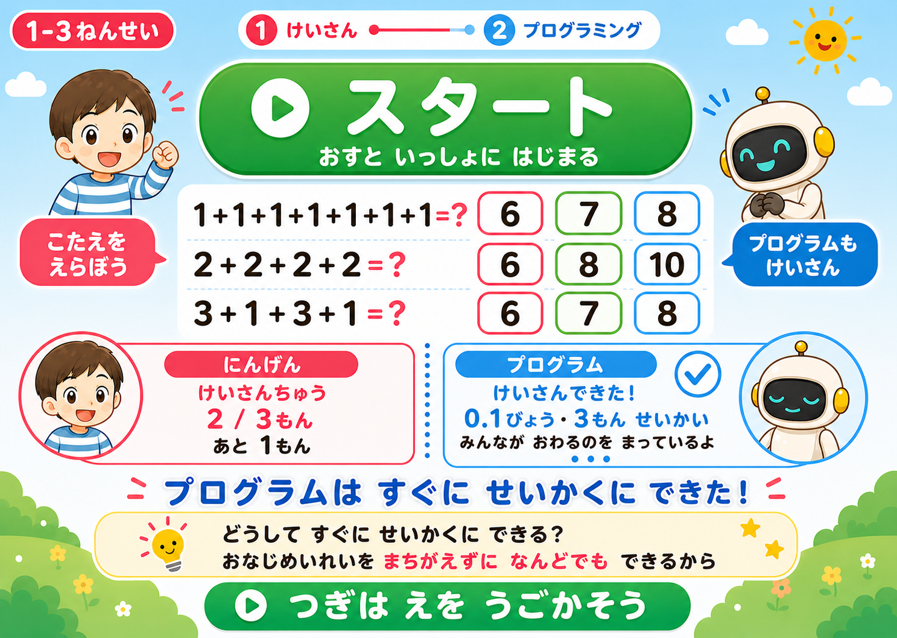
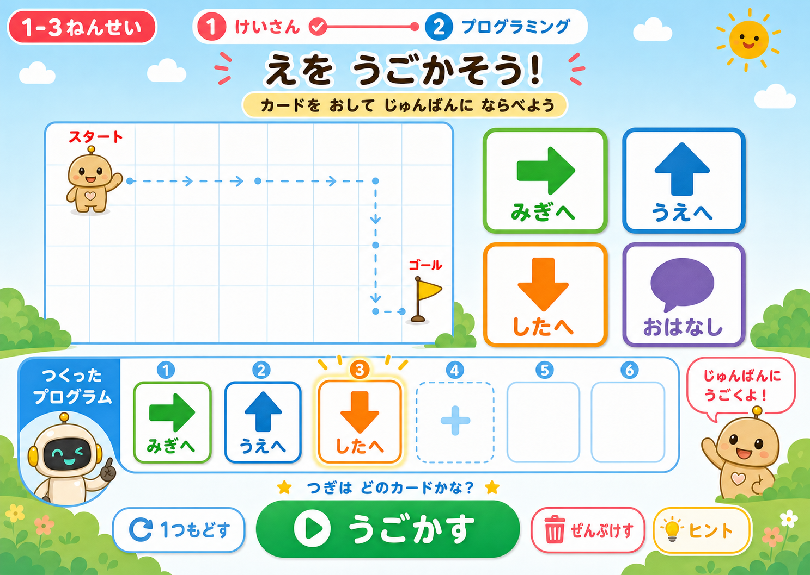
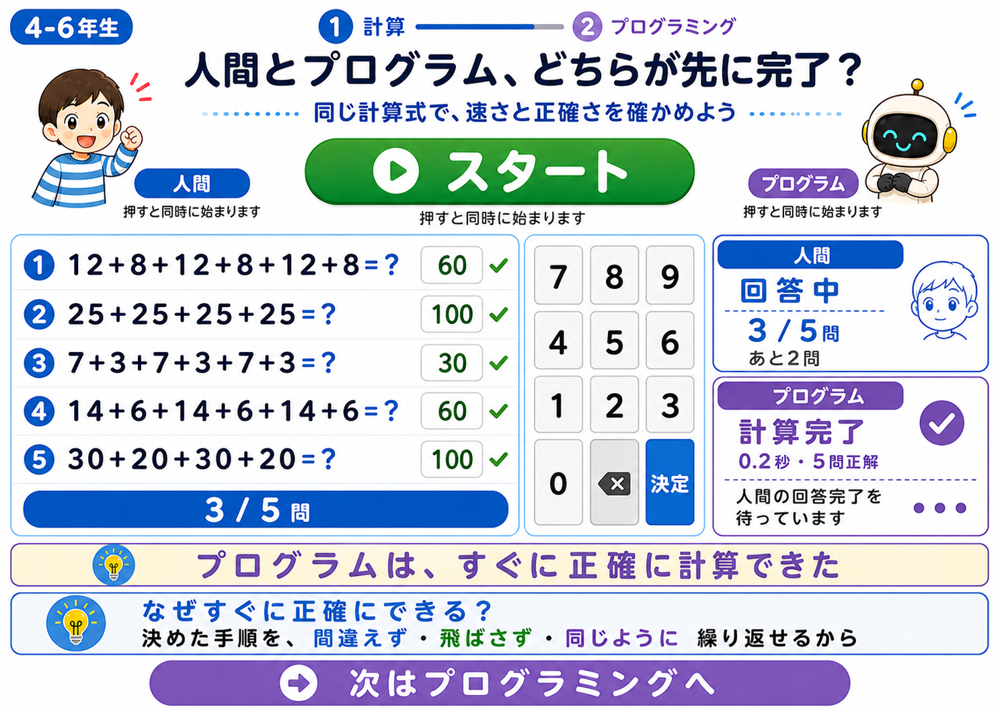
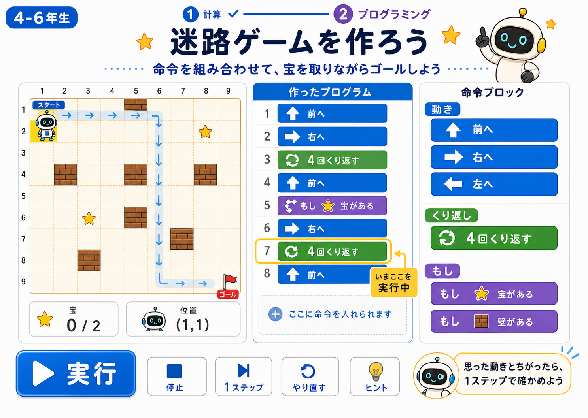

# 計算・プログラミング 4ページ構成の画面モック

> 画面設計に使ったモックと、対応する実装方針をまとめています。

## 低学年

### けいさんページ

- 「スタート」を押すと、人とプログラムが同時に計算を始める。
- プログラムはすぐ正しく計算を完了し、人の回答が終わるまで待機する。
- 順位や勝ち負けではなく、プログラム側の完了状態、時間、正解数を表示する。
- 画面内の日本語は漢字を使わず、ひらがな・カタカナで表示する。
- 固定の足し算を大きな選択肢で回答できるようにする。

### プログラミングページ

- 計算の対決表示は出さない。
- 大きな絵カードを押して、キャラクターをスタートからゴールまで動かす。
- 実行中のカードと、作ったプログラムの順番を分かりやすく表示する。
- 画面内の日本語は漢字を使わない。

## 高学年

### 計算ページ

- 「スタート」を押すと、人間とプログラムが同時に計算を始める。
- プログラムはすぐ正しく計算を完了し、人間の回答完了を待つ。
- 順位や勝ち負けではなく、プログラム側の完了状態、時間、正解数を表示する。
- 固定の足し算とテンキー入力を用意する。
- 結果のあとに、プログラムが速く正確な理由を短く説明する。

### プログラミングページ

- 対決、タイマー、順位、正解数の比較は出さない。
- 「動き」「くり返し」「もし」に命令を分類する。
- 実行中の命令を強調し、「実行」「やり直す」「見本」で確認できるようにする。
- 迷路、宝、壁、ゴールを使って順次処理・繰り返し・条件分岐を体験する。

## 採用した仕様

- 計算問題は固定とし、低学年3問、高学年5問を表示する。
- 人間側は全問に回答すると完了する。正解数は全問終了時にまとめて表示する。
- プログラム側は低学年0.1秒、高学年0.2秒で全問正解として表示し、人間側の完了を待つ。
- 計算完了後に理由を選び、近くの人と話してから学びのまとめを開く。
- 低学年の命令は、上下左右、色をぬる、おはなしを使う。
- 高学年の命令は、上下左右、くり返し、宝・壁・ゴールの条件を使う。

## 実装時の確認観点

- スタート操作で人間側とプログラム側の計測が同時に始まること。
- プログラム側が計算完了後に、人間側の回答完了待ちになること。
- 順位・勝者・敗者を表示せず、経過時間と正解数が正しく表示されること。
- 低学年ページに漢字が表示されないこと。
- プログラミングページに対決や順位の表示が混ざらないこと。
- iPadの横向きで主要ボタンと命令カードが押しやすいこと。
- 低学年・高学年のURLまたはモードが混ざらず、それぞれ2ページを遷移できること。
